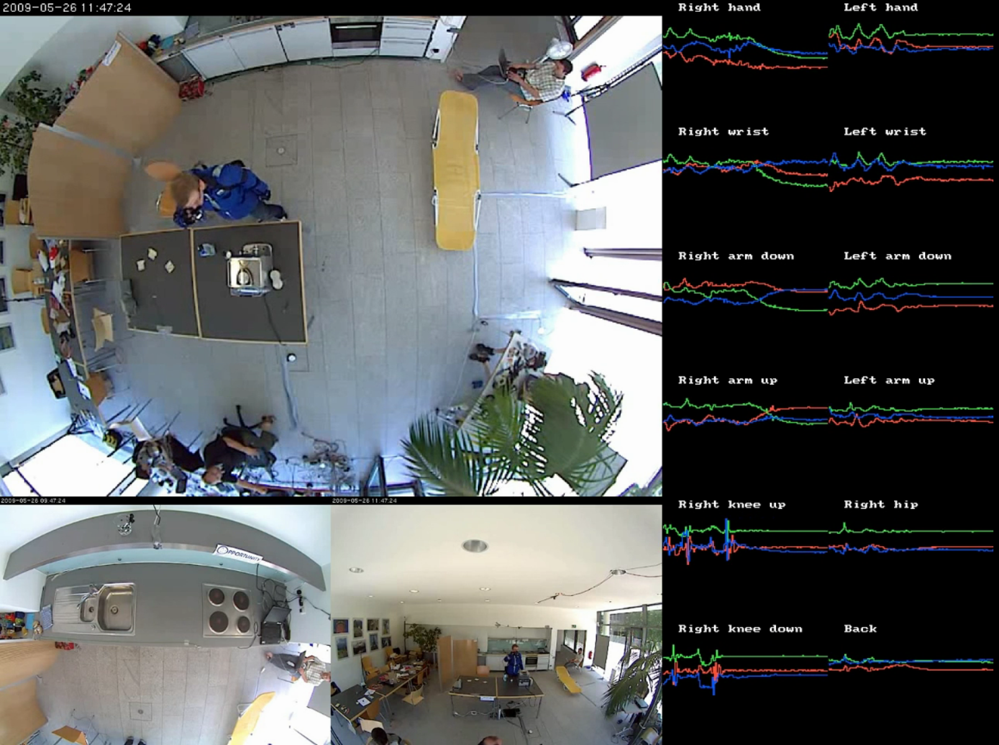
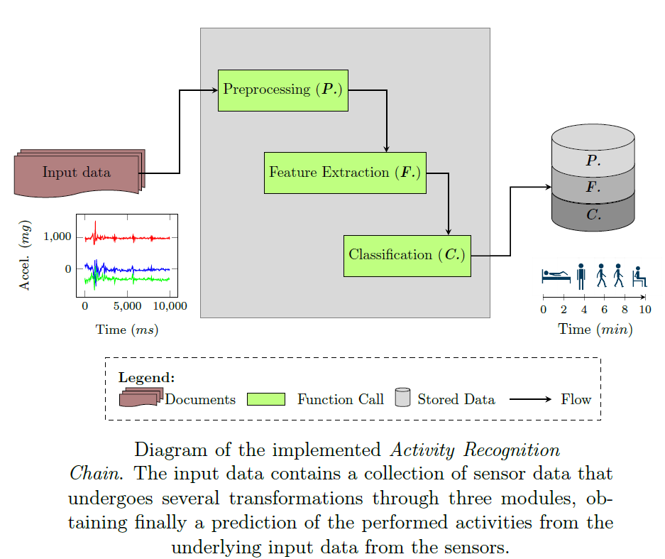
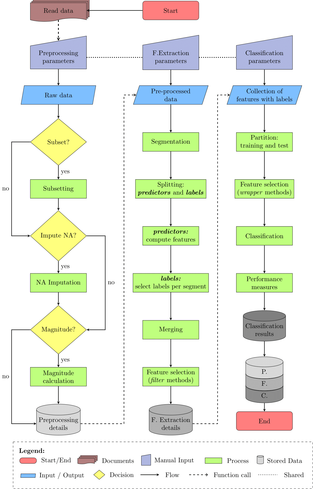
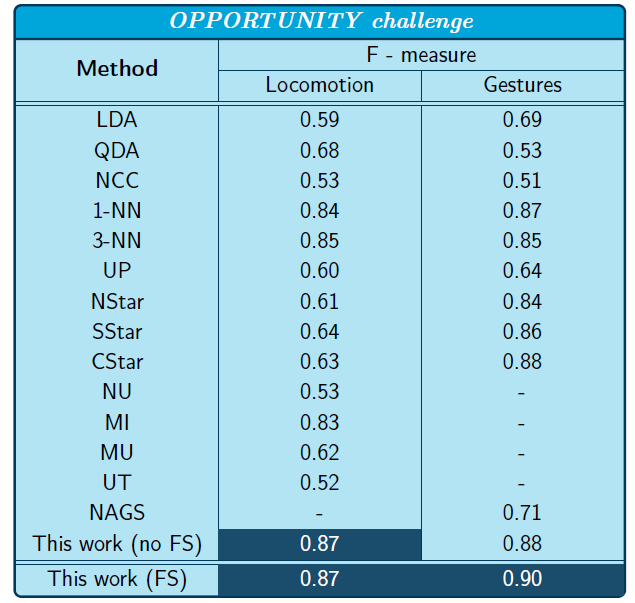

Overview
================

-   <a href="#summary" id="toc-summary">Summary</a>
-   <a href="#code-structure" id="toc-code-structure">Code Structure</a>
-   <a href="#results" id="toc-results">Results</a>

# Summary

This document presents an overview of the content of my bachelor thesis,
which was submitted on 10.07.2018 at **Universidad EAFIT** in
**Medellín, Colombia**. The full document is found within this
repository at
[`main_document.pdf`](https://github.com/Fustincho/bachelor-thesis/blob/master/main_document.pdf).

The work at its core consists of the implementation of an **Activity
Recognition Chain (ARC)**, a system that comprises stages for data
acquisition, preprocesssing, segmentation, feature extraction, and
classification, with the goal of classifying human activities based on
wearable sensor data.

The system was tested on the [OPPORTUNITY
dataset](https://archive.ics.uci.edu/ml/datasets/opportunity+activity+recognition),
a public benchmark dataset that was designed for Human Activity
Recognition and contains data from body-worn sensors that several test
subjects carried while simulating a scenario of activities of daily
life.

# Code Structure

The code was written in **[R](https://www.r-project.org/)**.

The following list mentions the packages that were used in the
implementation of the ARC, and a brief description of them:

-   [readr](https://readr.tidyverse.org/): a package focused on methods
    for importing data in R.
-   [tibble](https://tibble.tidyverse.org/): a modern approach of R data
    frames.
-   [dplyr](https://dplyr.tidyverse.org/): a collection of tools to
    manipulate tibbles (e.g., subset data, modify values from data,
    merge and split tibbles).
-   [imputeTS](https://cran.r-project.org/web/packages/imputeTS/index.html):
    a collection of univariate time series imputation methods.
-   [ggplot2](https://ggplot2.tidyverse.org/): a package dedicated to
    visualization methods of data.
-   [ggrepel](https://cran.r-project.org/web/packages/ggrepel/vignettes/ggrepel.html):
    an extension of layers that can be applied to ggplot2 graphics.
-   [purrr](https://purrr.tidyverse.org/): a package that allows to
    apply functions to lists and tibbles.
-   [stringr](https://stringr.tidyverse.org/): a collection of string
    manipulation tools.
-   [tictoc](https://cran.r-project.org/web/packages/tictoc/index.html):
    a helper package to track the runtime of R functions.
-   [caret](https://topepo.github.io/caret/): a library of machine
    learning methods and analysis tools.
-   [randomForest](https://cran.r-project.org/web/packages/randomForest/index.html):
    a package focused on random forest algorithms.

The code consists of four main sections that resume the ARC process:
reading data, preprocessing, feature extraction, and classification. The
last three sections were wrapped into functions to assure
reproducibility of the method with future datasets, while the reading
data process may have particularities according to the dataset (e.g.,
type of data, number of files, definition of NA values, column names
legend, labels legend).

  

# Results

The performance of the system was compared with the baseline results of
the OPPORTUNITY challenge [(Chavarriaga et al.,
2013)](https://linkinghub.elsevier.com/retrieve/pii/S0167865512004205).
The table summarizes the baselines of the challenge and the F-score
obtained by the best ARC configuration proposed in this work. Additional
results and observations are found in the [full
document](https://github.com/Fustincho/bachelor-thesis/blob/master/main_document.pdf).

This ARC was further used on a private dataset taken in the framework of
the REACH 2020 project. More details about the dataset and objectives
are found
[here](https://link.springer.com/article/10.1007/s12062-020-09260-z).
